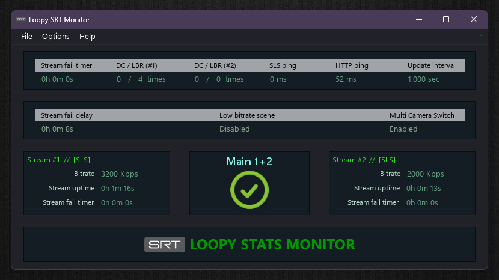

Loopy SRT Stats Monitor
=======================

<p>
    <p><a href="https://github.com/loopy750/SRT-Stats-Monitor/releases/latest"></a></p>
    <a href="https://github.com/loopy750/SRT-Stats-Monitor/releases/latest"></a>
</p>

Latest release available [here](https://github.com/loopy750/SRT-Stats-Monitor/releases/latest).   
Latest beta release if any are available can be found [here](https://github.com/loopy750/SRT-Stats-Monitor/tree/beta).

This is a program to assist with **IRL streaming** for popular streaming websites such as Twitch, using OBS Studio. This program is currently in use by many Twitch and YouTube streamers and has been proven to a be a valuable asset to their stream.

SRT is described as an open source video transport protocol that utilises the UDP transport protocol. It has several advantages over the abandoned RTMP protocol, including H.265/HEVC streaming.

Using a _homemade_ solution to SRT and/or RIST stream from your location back to your home PC, this program will automatically switch to a "low bitrate" scene whenever your connection is weak, a "fallback" OBS scene whenever your connection is lost, and is restored when your connection resumes.

Basic features `MultiCameraSwitch=false` allow a simple two-scene scenario, either "LIVE" or "FALLBACK" scene, with an optional "LBR" scene.

Advanced features `MultiCameraSwitch=true` consider for a two-camera multiple-scene scenario, with an optional "LBR" scene, and can alternate between scenes depending on the combination of cameras/streams used, i.e. stream 1, stream 2, and streams 1&2 simultaneously. See 'readme.txt' for a full description regarding these and other settings.
  
  Twitch streamer [sprEEEzy](https://www.twitch.tv/spreeezy) has been a big advocate of high quality IRL streaming at an affordable price, and helping test various equipment. SprEEEzy's [Discord](https://discord.gg/REgDtsTVar) has a channel for IRL streaming and techincal discussion. Both the hardware and software can be confusing at first, but as a community, helping each other, we can iron out all the bugs.
  
  I also have a [Discord](https://discord.gg/HQ23xS3ASt) and [Twitch](https://www.twitch.tv/loopy750) channel that I may or may not make use of one day.
  
  [Example of program being used in a live stream](https://user-images.githubusercontent.com/35911135/116689723-c2803680-a9fb-11eb-99bd-dbc29c6f75f5.mp4)
  
sprEEEzy's Guide
================

https://www.youtube.com/watch?v=ql2SizZLCPs

DOWNLOADS
=========

Programs to download
--------------------
OBS Studio - [https://obsproject.com/](https://obsproject.com/)  
obs-websocket-http - [https://github.com/IRLToolkit/obs-websocket-http/releases/latest](https://github.com/IRLToolkit/obs-websocket-http/releases/latest)   
Node.js - [https://nodejs.org/](https://nodejs.org/) <sup>_(not required if using obs-websocket-http)_</sup>  
VLC 64-bit - [https://www.videolan.org/vlc/](https://www.videolan.org/vlc/)  
OBS Tablet Remote - [http://t2t2.github.io/obs-tablet-remote/](http://t2t2.github.io/obs-tablet-remote/) <sup>_(requires [OBS WebSocket 4.9.1](https://github.com/obsproject/obs-websocket/releases))_</sup>

Known OBS SRT issues
--------------------
* [SRT streams have trouble connecting/reconnecting while Recording is running](https://github.com/obsproject/obs-studio/issues/4596) [_(possible solution)_](https://github.com/obsproject/obs-studio/issues/4596#issuecomment-1548255120)
* [obs-websocket-http doesn't reconnect on connection loss](https://github.com/IRLToolkit/obs-websocket-http/issues/11)

INSTALLATION
============

[Quick Start Guide (Resolve "Test #6 of 10 failed")](../main/modifications/resources/quick_start_guide.md)
-----------------

OBS Studio
----------
This guide assumes you have OBS installed and have spent time streaming and an understanding of how it works.

OBS Websocket
-------------
Open OBS, enable OBS Websocket, and create a password (Tools -> Websocket Server Settings).

Node.js <sup>_(not required if using obs-websocket-http)_</sup>
---------------------------------------------------------------
Following installation of Node.js, run _install.cmd_ within '_Documents\Loopy SRT Monitor_' to install "obs-websocket-js" and complete the installation.

VLC 64-bit
----------
This will be used in OBS as a ```VLC Video Source``` for the "fallback" streams. It has features not currently available with the default OBS video player.

* See the "Modifications" section below for recommended changes.

OBS Tablet Remote
-----------------
Remote access to OBS via OBS WebSocket. Can be used for starting and ending streams, but also recommended in general. Although every effort is made to ensure a smooth experience, issues such as network instability may produce unpredictable results. It is recommended to have remote access of OBS to allow manual control.


MODIFICATIONS
=============

OBS Studio (required)
---------------------
Open OBS, and within the "Media Source", configure your SRT stream. Consult the [OBS SRT & RIST Wiki](https://obsproject.com/wiki/Streaming-With-SRT-Or-RIST-Protocols) for more information. Ensure ```Restart playback when source becomes active``` is disabled. Recommended setting for ```Reconnect Delay``` is 1 second.


VLC 64-bit
----------
Open OBS, and within the "fallback" scene, add a source ```VLC Video Source```. Select your video that viewers will see when your connection is lost. The following settings are recommended: ```Loop Playlist``` enabled, ```Pause when not visible, unpause when visible``` enabled.


AdiIRC
------

[AdiIRC](https://www.adiirc.com/) is a free alternative to mIRC. If you have set ```FileStatusOutput=true``` for the purpose of outputting the stream status to a chat room, a sample script is supplied here. Edit [vars.ini](https://raw.githubusercontent.com/loopy750/SRT-Stats-Monitor/master/modifications/adiirc/vars.ini) with your channel name, and place in AdiIRC's root folder. Then load the [outputSRT.ini](https://raw.githubusercontent.com/loopy750/SRT-Stats-Monitor/master/modifications/adiirc/outputSRT.ini) script. Alt+R can be used to quickly access scripts.

A guide to connect AdiIRC to your Twitch chatroom can be found [here](./modifications/adiirc/guide/README.md).

Scripts can also be used to create chat commands. The following are some scripts that can be used and/or edited as required, or you can create your own.

| Command         | Notes                                                                                                    | Link             |
| --------------- | -------------                                                                                            | ---------------  |
| !b              | Admin, mod or user can retrieve current bitrate/s for SLS or NGINX stream/s                              | [outputBitrate.ini](https://raw.githubusercontent.com/loopy750/SRT-Stats-Monitor/main/modifications/adiirc/outputBitrate.ini) |
| !s [scene] | Admin or mod (rename ```moderator_name_1```) can manually change to any OBS Studio scene (obs-websocket-http)   | [setScene.ini](https://raw.githubusercontent.com/loopy750/SRT-Stats-Monitor/main/modifications/adiirc/setScene.ini) |
| !s [scene] | Admin or mod (rename ```moderator_name_1```) can manually change to any OBS Studio scene (obs-websocket-js 4.x) | [setScene_js4.ini](https://raw.githubusercontent.com/loopy750/SRT-Stats-Monitor/main/modifications/adiirc/setScene_js4.ini) |
| !s [scene] | Admin or mod (rename ```moderator_name_1```) can manually change to any OBS Studio scene (obs-websocket-js 5.x) | [setScene_js5.ini](https://raw.githubusercontent.com/loopy750/SRT-Stats-Monitor/main/modifications/adiirc/setScene_js5.ini) |


ADDITIONAL STEPS
================
OS firewall and router settings may prevent connecting to your home PC from an external source, such as mobile internet. Check firewall settings to allow the correct programs/ports to be accessed. Set a new rule for both inbound and outbound for the selected port.

Investigate how to use your router's "Port Forwarding" setting for allowing connections to the selected port. For security reasons, this should only be enabled while in use. If port forwarding does not work for your connection, your ISP might have CG-NAT enabled for your service and/or certain ports blocked. Confirm whether or not this is the case, and if so, contact your ISP and ask that it be disabled.

If you have been assigned a dynamic IP address from your ISP, [No-IP](https://www.noip.com/) is a great solution.

OBS WebSocket 5.x vs OBS WebSocket 4.x
======================================

**Loopy SRT Monitor** communicates with OBS via **OBS WebSocket**.

**OBS WebSocket 5.x** is a first-party plugin available with **OBS 28 and newer**. Unfortunately some applications might not be compatible with **OBS WebSocket 5.x**.

**Loopy SRT Monitor**, however, is compatible with both **OBS WebSocket 5.x** and **OBS WebSocket 4.9.1**, and will automatically detect and run whichever has been configured.

If you still require compatibility with **OBS WebSocket 4.9.1**, simply download and install [obs-websocket 4.9.1-compat](https://github.com/obsproject/obs-websocket/releases).

If you also require **Loopy SRT Monitor** to function with **OBS WebSocket 4.9.1** and/or **obs-websocket-js**, this allows you one of the following options:

## Option #1

* Following installation, Download and install [obs-websocket 4.9.1-compat](https://github.com/obsproject/obs-websocket/releases), and then, within the `Documents\Loopy SRT Monitor` folder, run `install.cmd` with option `2`. This will download `obs-websocket-js 4.0.3`, the last version to be compatible with **OBS WebSocket 4.x**.

* **Loopy SRT Monitor** configuration file `config.ini` must then be edited with the `WebSocketConnection` setting changed to `obs-websocket-js`, as `obs-websocket-http` is not compatible with **OBS WebSocket 4.x**. Note that the default port used by **OBS WebSocket 4.x** is **4444**, and **4455** for **OBS WebSocket 5.x**.

## Option #2

* Following installation, download and install [obs-websocket 4.9.1-compat](https://github.com/obsproject/obs-websocket/releases). Available in the **OBS** -> **Tools** menu should now be two independent settings, one for _4.x compat_, and one for _5.x_. Server Port numbers cannot be the same.

* To continue using **obs-websocket-js**, within the `Documents\Loopy SRT Monitor` folder, run `install.cmd` with option `1`. If not already downloaded, this will download the latest `obs-websocket-js` compatible with **OBS WebSocket 5.x**.

* **Loopy SRT Monitor** configuration file `config.ini` must then be edited with the `WebSocketConnection` setting changed to `obs-websocket-js`.

* To use `obs-websocket-http` however, follow the instructions in the installation and/or _readme.txt_ file and confirm `config.ini` contains `WebSocketConnection=obs-websocket-http`.

[F.A.Q.](../main/modifications/resources/faq.md)
-----------------

---

Send a tip - [https://github.com/loopy750/donate](https://github.com/loopy750/donate)
