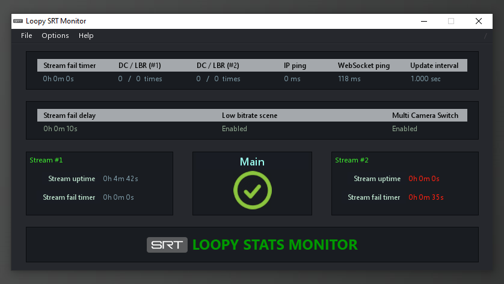

# Loopy SRT Stats Monitor

  
Latest release available [here](https://github.com/loopy750/SRT-Stats-Monitor/releases/latest).

This is a program to assist with "IRL streaming" for popular streaming websites such as Twitch, using OBS Studio. This program is currently in use by Twitch streamers and has been proven to a be a valuable asset to their stream.

SRT is described as an open source video transport protocol that utilises the UDP transport protocol. It has several advantages over the abandoned RTMP protocol, including H.265/HEVC streaming.

Using a "homemade" solution to SRT stream from your location back to your home PC, this program will automatically switch to a "fallback" OBS scene whenever your connection is lost, and is restored when your connection resumes.

Basic features (**_MultiCameraSwitch=false_**) allow a simple two-scene scenario, either "LIVE" or "FALLBACK" scene.

Advanced features (**_MultiCameraSwitch=true_**) consider for a two-camera multiple-scene scenario, and can alternate between scenes depending on the combination of cameras/streams used, i.e. stream 1, stream 2, and both stream 1&2 simultaneously. See 'readme.txt' for a full description regarding these and other settings.
  
  [Example of program being used in a live stream](https://user-images.githubusercontent.com/35911135/116689723-c2803680-a9fb-11eb-99bd-dbc29c6f75f5.mp4)
  
DOWNLOADS
=========

Programs to download
--------------------
OBS Studio - [https://obsproject.com/](https://obsproject.com/)  
OBS Websocket - [https://github.com/Palakis/obs-websocket/releases/latest](https://github.com/Palakis/obs-websocket/releases/latest)  
Node.js - [https://nodejs.org/](https://nodejs.org/)
VLC 64-bit - [https://www.videolan.org/vlc/download-windows.html](https://www.videolan.org/vlc/download-windows.html)

INSTALLATION
============

OBS Studio
----------
This guide assumes you have OBS installed and have spent time streaming and an understanding of how it works.

OBS Websocket
-------------
After installing OBS Websocket, create a password in OBS (Tools -> Websockets Server Settings).

Node.js
-------
Following installation of Node.js, run __install.cmd__ within '__Documents\Loopy SRT Monitor__' to install "obs-websocket-js" and complete the installation.

VLC 64-bit
----------
This will be used in OBS as a **_VLC Video Source_** for the "fallback" streams. It has features not currently available with the default OBS video player.

* See the "Modifications" section below for recommended changes.

MODIFICATIONS
=============

OBS Studio
----------
Open OBS, and within the "Media Source", configure your SRT stream. Consult the [OBS SRT Wiki](https://obsproject.com/wiki/Streaming-With-SRT-Protocol) for more information. Ensure **_Restart playback when source becomes active_** is disabled. Recommended setting for **_Reconnect Delay_** is 1 second.

VLC 64-bit
----------
Open OBS, and within the "fallback" scene, add a source **_VLC Video Source_**. Select your video that viewers will see when your connection is lost. The following settings are recommended: **_Loop Playlist_** enabled, **_Pause when not visible, unpause when visible_** enabled.

AdiIRC
------

[AdiIRC](https://www.adiirc.com/) is a free alternative to mIRC. If you have set **_FileStatusOutput=true_** for the purpose of outputting the stream status to a chat room, a sample script is supplied here. Edit [vars.ini](https://raw.githubusercontent.com/loopy750/SRT-Stats-Monitor/master/modifications/adiirc/vars.ini) with your channel name, and place in AdiIRC's root folder. Then load the [outputSRT.ini](https://raw.githubusercontent.com/loopy750/SRT-Stats-Monitor/master/modifications/adiirc/outputSRT.ini) script. Alt+R can be used to quickly access scripts.

ADDITIONAL STEPS
================
OS firewall and router settings may prevent connecting to your home PC from an external source, such as mobile internet. Check firewall settings to allow the correct programs/ports to be accessed. Set a new rule for both inbound and outbound for the selected port.

Investigate how to use your router's "Port Forwarding" setting for allowing connections to the selected port. For security reasons, this should only be enabled while in use. If port forwarding does not work for your connection, your ISP might have CG-NAT enabled for your service. Confirm whether or not this is the case, and if so, contact your ISP and ask that it be disabled.

If you have been assigned a dynamic IP address from your ISP, [No-IP](https://www.noip.com/) is a great solution.
