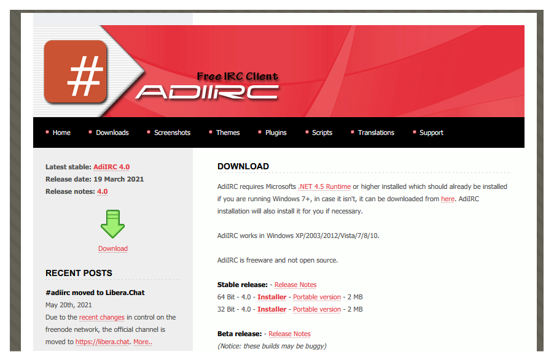
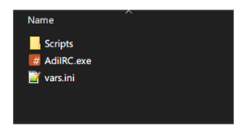
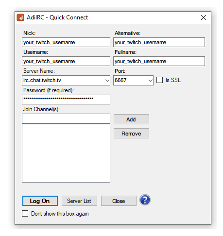
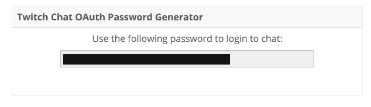

Configuring AdiIRC
==================

- Edit Loopy SRT Monitor's _config.ini_ file to enable `FileStatusOutput=true`
- Go to: [https://www.adiirc.com/](https://www.adiirc.com/)
- In this example we're downloading "**64 Bit - Portable version**"



- Create a folder for **_AdiIRC.exe_**
- Edit **_vars.ini_** with your Twitch username, eg: ```%channelName=#your_twitch_username```
- Copy **_vars.ini_** to the AdiIRC root folder
- Create a ```Scripts``` folder within the AdiIRC root folder and copy **_outputSRT.ini_**
- Copy **_outputBitrate.ini_** to the ```Scripts``` folder if you plan to use ```!b``` to output bitrate of compatible servers in chat



- Launch **_AdiIRC.exe_**
- **Server Name** is ```irc.chat.twitch.tv``` and **Port** is ```6667```



- To obtain your password/OAuth token, go to [https://twitchapps.com/tmi/](https://twitchapps.com/tmi/)
- Click **"Authorize"** if you trust **"Twitch Chat OAuth Token Generator"** and copy/paste the whole password into AdiIRC



- Click "**Log On**"
- Press _ALT_ + _R_ to open Scripts window and load scripts within that folder
- Close and reopen AdiIRC

For more information about commands, see https://github.com/loopy750/SRT-Stats-Monitor#adiirc
